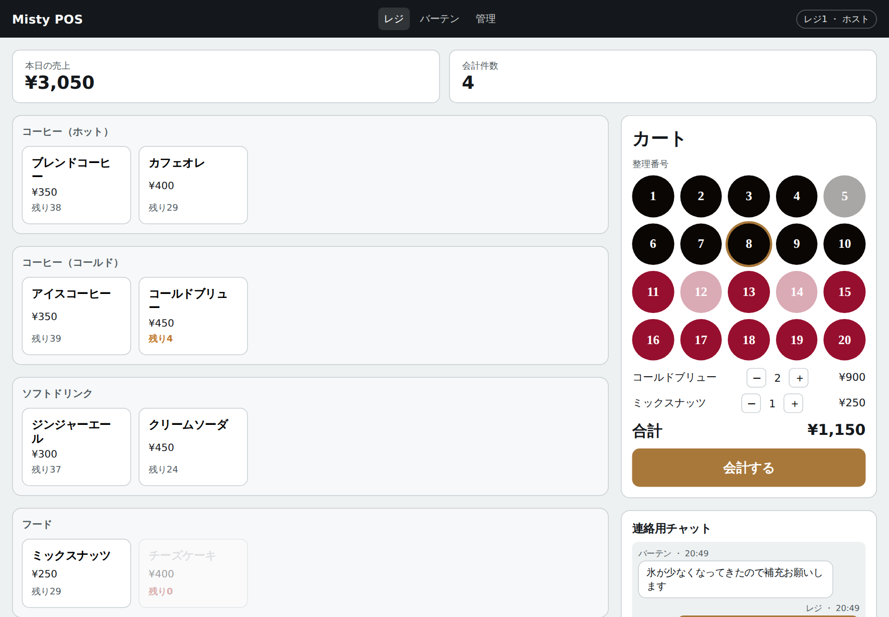
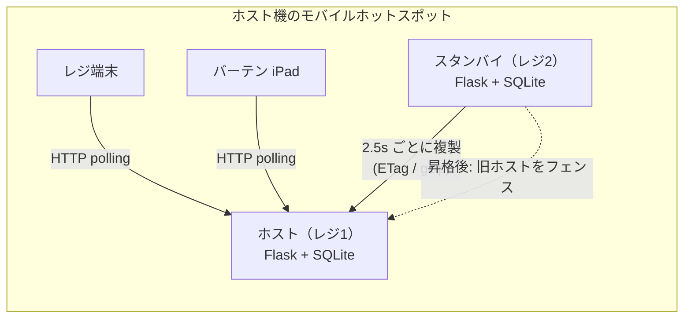
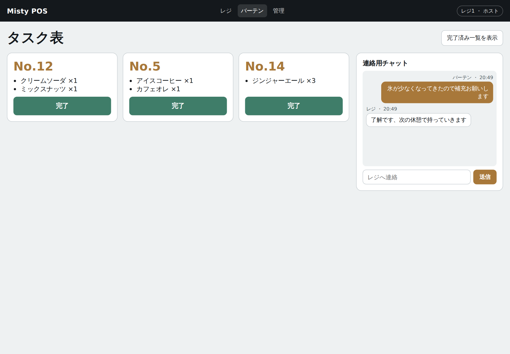
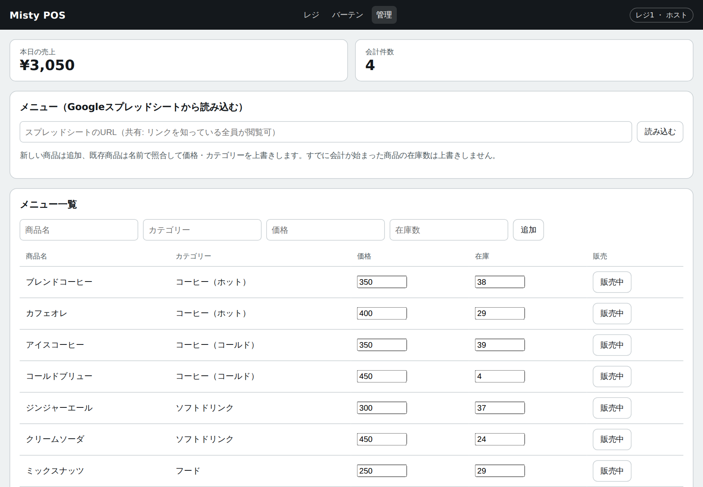

# Misty POS

**サーバーもルーターもない学園祭の模擬店で、ノートPC 2台だけで「止まらないレジ」を作る POS システム。**

理大祭に出店するジャズバー「Misty」のレジ・バーテン間の注文連携のために開発した（本番運用前）。
ノートPC のモバイルホットスポットを LAN にし、2台目のノートPC を hot standby として待機させる。
レジ機が電池切れや故障で止まると、約10秒後に待機機が人の操作なしでホストに昇格し、会計を引き継ぐ。



## 30秒で読むポイント

| | |
|---|---|
| 何を作ったか | レジ・バーテン・管理の3画面を持つ POS。iPad やノートPC のブラウザから QR で接続する |
| 一番難しかったところ | 追加機材なしの冗長化。複製・自動昇格に加え、復帰した旧ホストとの二重書き込み（スプリットブレイン）を epoch によるフェンシングで防ぐ |
| 整合性の守り方 | 「札1枚に準備中の注文は1件」「在庫はマイナスにならない」などの不変条件を DB 制約で表現。状態遷移は条件付き UPDATE で原子的に行う |
| 不安定な回線への対策 | 冪等キー付きの会計再送、タイムアウトとバックオフ付きポーリング、ETag + gzip の差分なし複製スキップ |
| 検証 | pytest 59件（同時会計の競合、2ノード間のフェイルオーバーを1プロセスで再現）、実プロセスでの障害訓練スクリプト、複製コストのベンチマーク。GitHub Actions で Windows / Linux × Python 3.10 / 3.12 |

## 構成



Python 3.10+ / Flask 3 / waitress / SQLite（WAL）/ 素の JavaScript（ビルド工程なし）/ PWA

詳しい設計判断は **[docs/ARCHITECTURE.md](docs/ARCHITECTURE.md)** に書いた。

## 技術的に工夫した点

### 1. 追加機材なしで冗長化する（`misty/standby.py`, `misty/runtime.py`）

- standby は host のスナップショットを 2.5 秒ごとに取り込む。書き込みごとに増える世代番号を ETag にし、
  変化がない周期は 304 で転送も再書き込みも省く。
- 失敗が 10 秒続いたら昇格し、Windows のモバイルホットスポットを WinRT API で起動する。
  両機の SSID を揃えておけば、各端末は OS の自動再接続で standby に乗り換える。
- 旧ホストが復帰すると書き込み可能なノードが2台になる。昇格のたびに増える epoch
  （Raft の term と同じ考え方）を比べ、新しい側が古い側を読み取り専用にする。時計のずれに影響されない。
- 経過時間は `time.monotonic()` で測る。一度も同期できていない standby は昇格しない（空のデータでホストになるのを防ぐ）。

```
$ python scripts/failover_drill.py        # 実プロセス2つ・実 HTTP での障害訓練
[1] host で会計: HTTP 201 order#1
[2] standby に複製された
[3] host 停止から 5.0 秒で standby が昇格 (epoch=2, 閾値 4.0s / 周期 1.0s)
[4] 昇格後の会計: 新しい札 HTTP 201 / 複製済みの札1 HTTP 409（排他が引き継がれている）
[5] 旧 host を再起動 → 0.7 秒でフェンス。旧 host への書き込み: HTTP 409 (standby)
```

### 2. 同時操作でも壊れないデータ（`misty/db.py`, `misty/models.py`）

- 同じ整理番号札に「準備中」の注文が2件できないよう、部分ユニークインデックスで保証する。
  レジ2台が同時に同じ札で会計しても、判定は DB が原子的に行う。
- 状態遷移は `UPDATE ... WHERE status = <遷移元>` の影響行数で成否を判定する。
  取消が同時に来ても在庫を戻すのは1回だけ。
- Python の sqlite3 の暗黙トランザクションを切り、書き込みは `BEGIN IMMEDIATE` の
  コンテキストマネージャだけで行う。状態変更と操作ログは同じトランザクションで書く。

### 3. 途切れる前提の通信（`misty/static/js/common.js`, `register.js`）

- 会計にはクライアント生成の冪等キーを付ける。応答だけ届かずに再送しても二重計上しない。
- `crypto.randomUUID()` は http の LAN アドレスでは使えない（安全なコンテキスト限定）ため、
  `getRandomValues()` で ID を作る。
- ポーリングは前回の完了後に次を予約する方式にし、失敗時は間隔を指数的に延ばす。
  フェイルオーバー直後に全端末が昇格したばかりのノードへ殺到しない。

### 4. 現場の環境でつまずく所を先に潰す

- ホスト機は上流 Wi-Fi とホットスポットの2つのアドレスを持つ。既定ルートのアドレスを QR に載せると
  端末から届かないので、全 NIC のアドレスを集めてホットスポット側（192.168.137.0/24）を優先する（`misty/netinfo.py`）。
- 非公開のスプレッドシートは 200 OK でログイン画面を返す。HTML を検出してエラーにし、
  「0件取込」で静かに成功するのを防ぐ（`misty/sheets.py`）。
- CSV は BOM 付き UTF-8 で出す（Windows の Excel で文字化けしないため）。
  bat ファイルは CRLF 固定・`chcp 65001` で、日本語の端末名が化けないようにした。

## 計測

`scripts/bench_sync.py`（注文 3,000 件＝明細 6,000 行＋操作ログ 3,000 行、開発機で計測）

| 項目 | 値 |
|---|---|
| 複製スナップショット | 約 1.7 MB → gzip で約 65 KB（合成データのため実データより圧縮が効く） |
| host の export / standby の apply | 約 23 ms / 約 55 ms |
| 変化がない周期のコスト（ETag 照合） | 約 0.005 ms |

## 動かし方

```bash
pip install -r requirements-dev.txt
python run.py                      # http://127.0.0.1:5000/ で接続画面
pytest                             # 59 tests
python scripts/failover_drill.py   # 障害訓練（ポート 5301/5302 を使う）
python scripts/bench_sync.py       # 複製コストの計測
```

当日の起動手順・設定項目・トラブル対応・実機検証チェックリストは [docs/operations.md](docs/operations.md)。

| バーテン画面 | 管理画面 |
|---|---|
|  |  |

## 既知の制約

- 本番（学園祭当日）での運用はまだ。ホットスポットの自動起動と、端末の自動乗り換えは Windows 実機で未検証。
- host が突然止まると、最後の複製以降（最大約2.5秒）の会計は standby に届かない。旧 host の DB には残るので、
  操作ログ CSV で突き合わせて補正する。同期複製にすれば防げるが、standby の不調で会計が止まるため採らなかった。
- アプリにログイン機能はなく、ホットスポットのパスワードを信頼境界にしている（理由は設計書 9章）。

## 開発の進め方

要件（整理番号札の運用、レジとバーテンの分担、追加機材を買わないこと）は出店する部の運用に合わせて決めた。
実装には AI コーディングエージェント（Claude Code）を使い、設計上の判断と受け入れ基準は自分で決めた。
AI が書いたコードは、不変条件を突くテストと障害訓練スクリプトで振る舞いを確かめてから採用している。
レビューで見つかった不具合（画面スクリプトの読み込み順が原因で全画面が動かない、同じ商品を複数行で送ると
在庫を超えて売れる など）は、再現テストを先に書いてから修正した。

## ディレクトリ

```
misty/
  app.py          アプリケーションファクトリ（設定・状態をアプリごとに保持）
  config.py       環境変数 → イミュータブルな Settings（起動時に検証）
  runtime.py      役割・epoch・フェンス状態
  db.py           スキーマ（不変条件の制約）、トランザクション、スナップショット読み取り
  models.py       会計・状態遷移・取込・複製のドメインロジック
  standby.py      監視・複製・昇格・フェンシングの状態機械
  errors.py       HTTP ステータス付きドメイン例外
  sheets.py       スプレッドシート取込（再試行・HTML 検出）
  netinfo.py      QR に載せるアドレスの選択
  network.py      ホットスポット自動起動（WinRT / PowerShell）
  routes/         JSON API と画面
  static/, templates/
tests/            pytest（競合・フェイルオーバー・取込・入力検証）
scripts/          障害訓練、ベンチマーク、起動用 bat、PyInstaller 設定
docs/             設計書、運用手順、スクリーンショット
```
