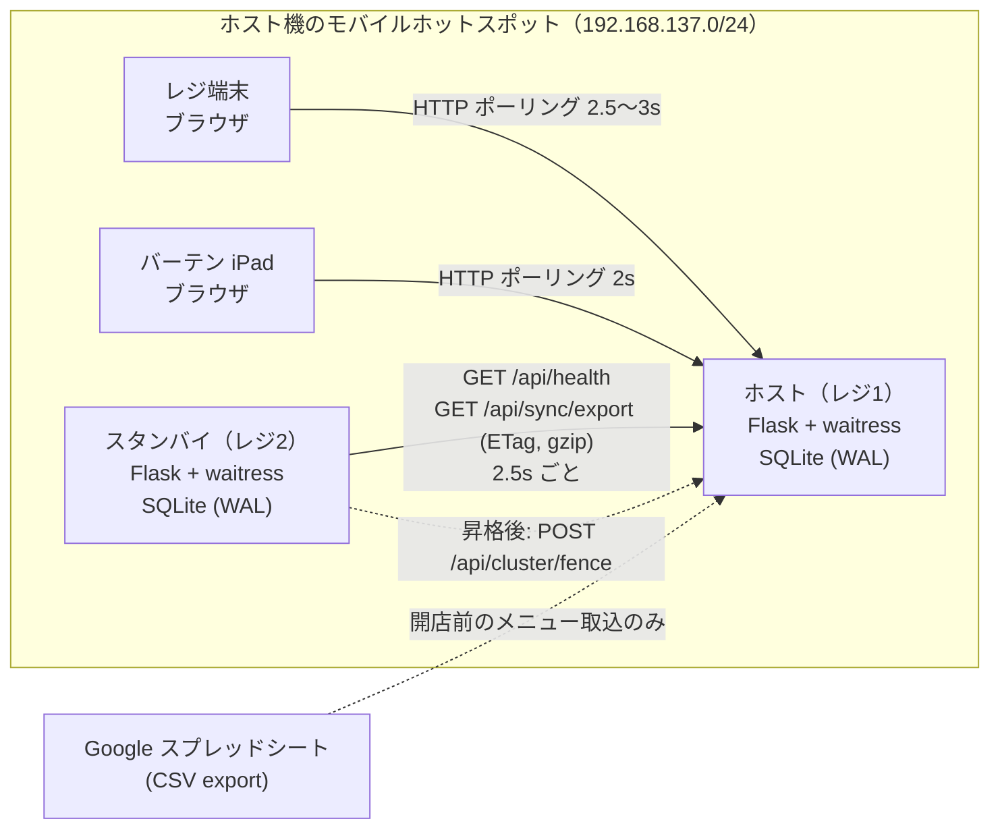
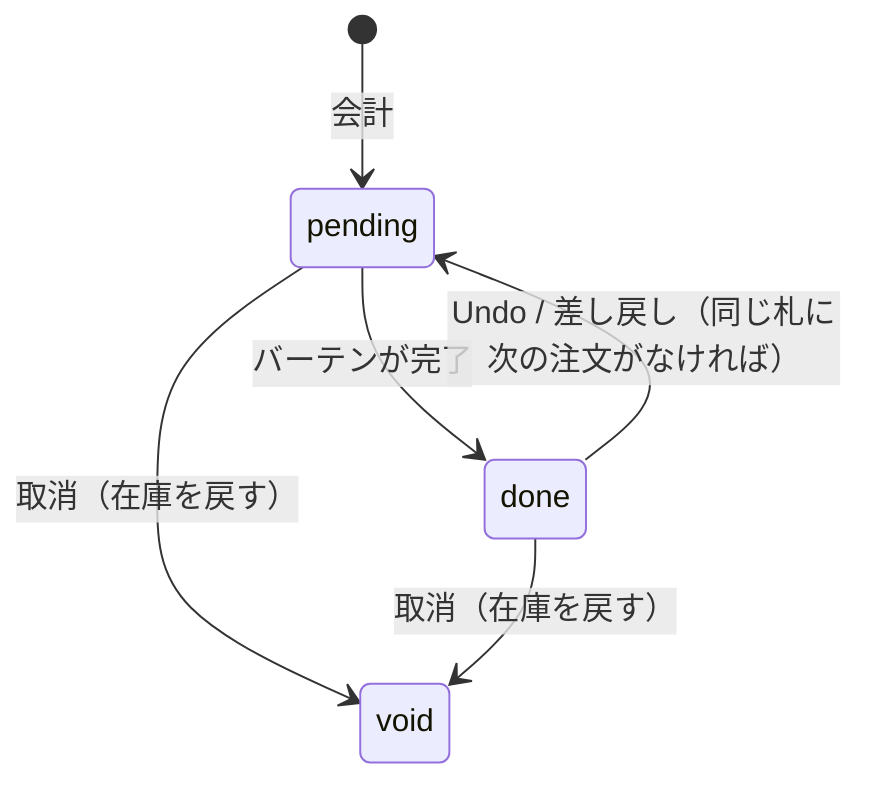
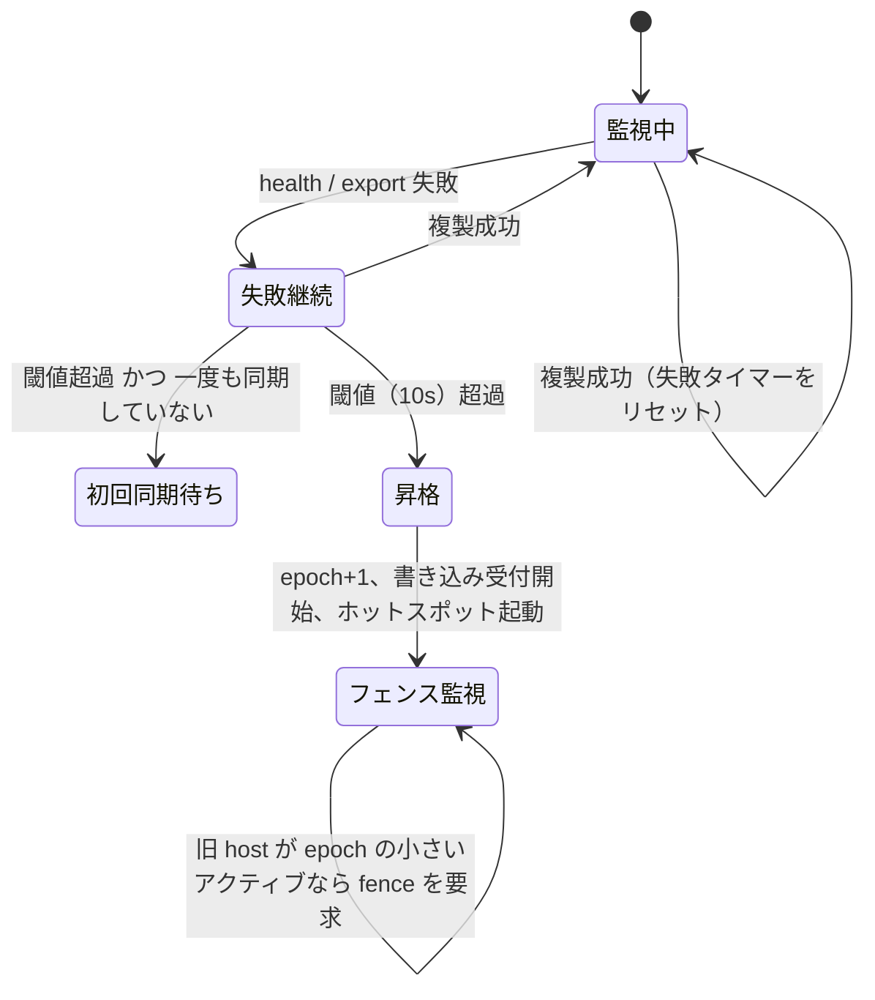

# Misty POS 設計書

## 1. 前提と制約

| 制約 | 設計への影響 |
|---|---|
| 会場にネットワーク設備がない。ルーター・サーバーは買わない | ノートPC のモバイルホットスポットを LAN にし、ノートPC 自身をサーバーにする |
| 会場の回線は不安定。インターネットに出られない時間帯がある | クラウドに依存しない。外部通信はメニュー取込（開店前）だけ |
| 営業中にレジ PC が落ちても会計を止めたくない | 2台目のノートPC を hot standby にし、人の操作なしで昇格させる |
| 操作する部員は毎年入れ替わり、IT に詳しいとは限らない | 起動は bat のダブルクリック、接続は QR、メニューはスプレッドシート |
| 端末はレジ 1〜2台、バーテン 1台、管理 1台程度。会計は多くて毎分十数件 | 単一ライターの SQLite で足りる。分散合意（Raft 等）は持ち込まない |

## 2. 全体構成

- サーバーは Flask のアプリケーションファクトリ（`misty/app.py`）。設定・実行時状態はアプリごとに持ち、
  モジュールのグローバル変数にしない。これで1プロセス内に host と standby を並べて
  フェイルオーバーを統合テストできる（`tests/test_failover.py`）。
- WSGI サーバーは waitress。Windows で動き、PyInstaller で exe にしやすい純 Python 実装。
- 画面は素の JavaScript。ビルド工程を持たないので、当日に static ファイルを差し替えるだけで直せる。

## 3. データモデルと不変条件

不変条件はできるだけ DB の制約で表現し、アプリのコードが間違えても壊れないようにした。

| 不変条件 | 守り方 |
|---|---|
| 1枚の整理番号札が「準備中」の注文を2件以上持たない | 部分ユニークインデックス `orders(seat_no) WHERE status='pending'` |
| 在庫はマイナスにならない | `CHECK (stock_qty >= 0)` ＋ 会計時にカートを商品ごとに合算してから判定 |
| 同じ会計を2回計上しない | クライアント生成の `request_id` に UNIQUE。再送時は既存の注文を返す |
| 取消で在庫を2回戻さない | `UPDATE ... WHERE status IN ('pending','done')` の影響行数が 1 のときだけ戻す |
| 状態変更と操作ログが食い違わない | 同じトランザクションで書く |
| 会計後にメニューを変えても売上が変わらない | 明細に商品名と単価を複製して保存 |

### 状態遷移

遷移はすべて「遷移元の状態を WHERE 句に入れた条件付き UPDATE」で行う。
SELECT で状態を確かめてから UPDATE すると、その間に別の端末の操作が挟まる（check-then-act）。
条件付き UPDATE なら判定と更新が1文で原子的になり、影響行数 0 なら「先を越された」と分かる。

## 4. 並行性とトランザクション

- `sqlite3.connect(isolation_level=None)` で Python の暗黙トランザクションを切り、
  書き込みは `db.transaction()`（`BEGIN IMMEDIATE`）だけで行う。
  - `BEGIN DEFERRED` だと、在庫を読んだ後に書こうとした時点でロック昇格に失敗しうる。
    読んでから書く処理は最初から書き込みロックを取る。
  - 待ちは `busy_timeout` 10 秒。レジ数台の書き込み頻度なら待ちはほぼ発生しない。
- WAL モードでバーテン画面などの読み取りが書き込みを待たない。
- `synchronous=FULL`。WAL + NORMAL の方が速いが、電源断で直前のコミットを失いうる。
  ノートPC の電池切れはこのシステムが想定する障害そのものなので、耐久性を取った。
- 複数テーブルを読む処理（複製用スナップショット、売上集計）は読み取りトランザクション内で行う。
  WAL では文ごとに最新コミットが見えるので、トランザクション外で `orders` → `order_items`
  と順に読むと、間に入った会計の「明細のない注文」を複製してしまう。

テスト（`tests/test_orders.py`）では、スレッド 8〜12 本を Barrier で同時に走らせ、
同じ札への同時会計・在庫 5 個への 12 件同時会計・同じ注文への同時取消を検証している。

## 5. 複製とフェイルオーバー

### 5.1 複製

standby は 2.5 秒ごとに host の全データをスナップショットで取得し、自分の DB を丸ごと置き換える。

差分ではなく全量にした理由:
注文は後から状態が変わる（完了・取消）ので、id の増分だけでは変更を拾えない。
変更ログを別に持つと、ログ自体の複製・切り詰め・再送の設計が必要になる。
学園祭1日の規模なら全量でも十分に軽い（下表）。

`scripts/bench_sync.py` の計測（開発機、Python 3.11、注文 3,000 件＝明細 6,000 行＋操作ログ 3,000 行）:

| 項目 | 値 |
|---|---|
| スナップショット JSON | 約 1.7 MB（gzip 後 約 65 KB ※合成データのため実データより圧縮が効く） |
| host 側の export | 約 23 ms |
| standby 側の apply（全削除＋一括挿入） | 約 55 ms |
| 変化がない周期（ETag 照合のみ） | 約 0.005 ms |

- 書き込みトランザクションのたびに `meta.data_version` を +1 し、`"{epoch}-{data_version}"` を ETag にする。
  変化がなければ 304 を返し、全テーブルの読み出し・JSON 化・転送・standby 側の再書き込みをすべて省く。
- レスポンスは gzip。ホットスポットの帯域を会計の通信と奪い合わないため。
- standby の HTTP は `requests.Session` を使い回し、周期ごとの TCP 接続を省く。

### 5.2 昇格

- 経過時間は `time.monotonic()` で測る。ホットスポット機が上流に繋がった瞬間に NTP で時計が補正されると、
  `time.time()` の差分が跳んで誤昇格や昇格遅延の原因になる。
- 一度も同期できていない standby は昇格しない。standby を先に起動した場合に、空の DB でホストになるのを防ぐ。
- 相手が応答しても `is_active=false`（スタンバイ・フェンス済み）なら失敗として数える。
- 昇格までの時間: 閾値 10 秒 ＋ 最大1周期 2.5 秒 ＋ ヘルスチェックのタイムアウト 2 秒 ≒ 最大 15 秒弱。
  `scripts/failover_drill.py`（閾値 4 秒・周期 1 秒に縮めて実行）では、host のプロセスを kill してから
  5.0 秒で昇格した。

### 5.3 スプリットブレインとフェンシング

旧 host が再起動などで復帰すると、アクティブなノードが2台になる。どちらを正とするかは
epoch（昇格のたびに増える番号、Raft の term と同じ考え方）で決める。時刻で決めないのは、
ノートPC 同士の時計が合っている保証がないため。

1. host は epoch=1 で動く。standby は複製のたびに host の epoch を記録する。
2. 昇格時に epoch = 記録した epoch + 1 として DB に永続化する。
3. 昇格した側は旧 host のヘルスを見続け、`is_active` かつ epoch が小さければ
   `POST /api/cluster/fence` を送る。受けた側は自分より大きい epoch からの要求に限って書き込みを止める。
4. フェンスされた旧 host の画面には「新しいホストに繋ぎ直してください」と出る。

`scripts/failover_drill.py` では、旧 host を再起動してから 0.7 秒でフェンスされ、
書き込みが 409 で拒否されることを確認している。

### 5.4 RPO（失いうるデータ）

host が突然止まった場合、最後の複製以降（最大で約 1 周期 = 2.5 秒）の会計は standby に届かない。
ただし消えるわけではなく、`synchronous=FULL` で旧 host の SQLite に残っている。
旧 host を起動するとフェンスされて読み取り専用になるので、操作ログ CSV を突き合わせて手で補正する。
同期複製（host が standby の書き込み完了を待ってから応答する）にすれば RPO は 0 にできるが、
standby が不調なだけで会計が止まる。今回は「会計を止めない」を優先した。

## 6. クライアント（ブラウザ）

| 課題 | 対策 |
|---|---|
| ホットスポットの掴み直し中、fetch が数十秒ぶら下がる | `AbortController` で 6 秒タイムアウト |
| 応答が周期より遅いとリクエストが積み上がる | `setInterval` をやめ、完了後に次を予約するポーリング |
| フェイルオーバー直後に全端末が一斉に叩く | 失敗時は周期を指数的に延ばす（最大 15 秒） |
| 会計の応答だけ届かない | 冪等キー `request_id` を付けて最大3回再送。400/409 は再送しない |
| `crypto.randomUUID()` は http の LAN アドレスでは使えない（安全なコンテキスト限定） | `crypto.getRandomValues()` で ID を組み立てる |
| 3 秒ごとに DOM を作り直すと、押している最中のボタンが消える | 内容に変化があったときだけ描き直す |
| 商品名や操作ログに HTML を仕込める | サーバー由来の文字列は必ず `Misty.esc()` を通す |
| 日本語入力の変換確定の Enter でチャットが送信される | `isComposing` を見る |
| HTTP ヘッダーに日本語の端末名を入れると fetch が例外になる | URL エンコードして送り、サーバーで戻す |

service worker は `/service-worker.js`（ルート）から配信する。`/static/` から配信すると
制御範囲が `/static/` 以下に限られ、画面を制御できない。静的ファイルはネットワーク優先にし、
サーバー更新後に iPad が古い JS を使い続けないようにした。API はキャッシュしない。

## 7. 外部連携（Google スプレッドシート）

Sheets API（OAuth）ではなく共有リンクの CSV エクスポートを使う。毎年入れ替わる部員が
「URL を貼るだけ」で運用できることを優先した。

- 非公開のシートは 200 OK でログイン画面の HTML が返る。そのままだと「0件取込」で静かに成功するので、
  Content-Type と本文先頭で HTML を検出してエラーにする。
- 接続エラー・429・5xx は指数バックオフ（0.5s, 1s）で 3 回まで再試行。4xx は即座に返す。
- 取込は1トランザクションで、全件成功か全件ロールバック。不正な行は行番号と理由を返す。

## 8. エラー処理の方針

- ドメイン例外（`misty/errors.py`）に HTTP ステータスとエラーコードを持たせ、API 層の
  エラーハンドラ1か所で `{"error", "message"}` の JSON にする。想定外の例外もログを残して JSON の 500 で返す。
  フロントは常に JSON を前提にできる。
- 入力は境界（`models.py` の `_int` / `_text`）で型・範囲を検証する。未知のフィールドは黙って無視せず 400 にする。
- 設定は起動時に検証し、不正なら起動しない（`Settings.__post_init__`）。
- ホットスポット自動起動のようなベストエフォート処理は例外を外に出さず、結果を操作ログに残す。

## 9. セキュリティと信頼境界

信頼境界はホットスポットの WPA2 パスワード。アプリにログインはない。
部員が共用のタブレットを使い回し、フェイルオーバーで接続先が変わっても再ログインを求めないため。

- ノード間 API（`/api/sync/*`, `/api/cluster/*`）は `MISTY_CLUSTER_TOKEN` を設定すると共有トークン必須になる
  （比較は `hmac.compare_digest`）。フェンス要求を偽装されると host が止まるので、会場のネットワークを
  信頼できない場合は設定する。
- XSS: サーバー由来の文字列はエスケープしてから描画する。
- SQL: 値はすべてプレースホルダ。動的に組み立てる列名はホワイトリスト由来のみ。

## 10. 既知の制約

- ホットスポット自動起動（WinRT の `NetworkOperatorTetheringManager`）は Windows 実機での検証がまだ。
  上流のネット接続がない状態では起動できない可能性がある。
- 端末が新しいホットスポットに自動で乗り換えるかは OS 任せ。乗り換えない端末は QR を読み直す運用で補う。
- 元のホストへ戻す（フェイルバック）は手動。自動化すると、復帰直後の旧ホストの古いデータで上書きする事故が起きうる。
- ノードは2台固定。3台以上で多数決を取る構成（Raft 等）は、機材を増やせない前提と規模に見合わない。
